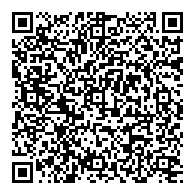

# Markdownの本を一緒に作りたい

---

## 私は誰？

- 藤原 由来（ふじわら ゆき）
    - [Twitter: sky_y](https://twitter.com/sky_y), [Qiita](http://qiita.com/sky_y), [GitHub](https://github.com/sky-y)
    - 兵庫県から来ました
- フリープログラマ・技術ライター、某専門学校 非常勤講師
- 日本Pandocユーザ会代表
    - [Pandocユーザーズガイドの翻訳](http://sky-y.github.io/site-pandoc-jp/users-guide/)
    - [OSPN Press「オープンソース」を使ってみよう (Pandoc)](https://www.ospn.jp/press/20170705no52-useit-oss.html)

---

## モダンなMarkdown本、ほしいですよね？

---

## Markdown本、書く人・作る人募集します

---

## 先行事例

- 清水 美樹: [はじめてのMarkdown―軽量マークアップ言語の記法と使い方 (I・O BOOKS) ](http://www.amazon.co.jp/dp/4777518329/)
- 「MultiMarkdownでHTMLを書く本」
    - 現在の「多目的」「多方言＋CommonMark」という状況が反映できてない
- 古い: 2014/5/14発売
    - 参考: 最古の[CommonMark Spec](http://spec.commonmark.org/) (v0.5): 2014/10/25

---

## こういうMarkdown本を書きたい

注意: 藤原の頭の中にある企画なので、要ブラッシュアップです

---

## ターゲット1: 初心者向け

- Markdownには興味があるけど、実際よく分からないし食わず嫌いしている人
- 既にMarkdownを消極的に使わされている人
- 執筆自体はよくする人（作家、ブロガーなど）
    - WordPressやMS Wordなどの基本機能は使える人
    - 本当はテキストエディタでゴリゴリ原稿を書きたい人

---

## ターゲット2: 他のマークアップ記法に慣れている人向け

- HTML, reStructuredText, AsciiDoc, Emacs Org, ...
- **Markdownの欠点や限界**をきちんと示してあげる
    - 一通り紹介して「やっぱりMarkdownが嫌い」と思ってもらうことは否定しないし、代替案も紹介する
- Markdownの**実用的な**リファレンスがほしい
    - 単一の方言でなく、主要方言をある程度網羅し比較できる

---

## 提案

- 覚えやすくてミニマムなMarkdown仕様を提案
    - 目標: どのアプリでも**7～8割ぐらい**は書ける
    - 例: [LEARN MARKDOWN IN 60 SECONDS](http://commonmark.org/help/)
    - **Markdownの全部を覚えさせない**
- 応用: よく使われるサービス・アプリを厳選して書き方を紹介（要検討）
- 巻末付録: Markdownリファレンス（詳細版）

---

## 本企画の責任外

- ほしいけど今やらない
    - Markdownの仕様を詳細に議論する本
        - 企画段階での議論はもちろん必要
    - Markdownに対応するサービス・アプリを網羅した一覧・レシピ本
        - どちらかといえばWikiっぽいのが良い？
        - 作りかけ: [ドキュメンテーションWiki](https://github.com/doc-wiki-jp/wiki/wiki)
- 論外
    - 「Markdown知ってる俺スゲー」本

---

## 募集する人

- 執筆者
- 編集者・出版社
- こういう人と一緒に書きたい
    - 読者（Markdown初心者）の立場に寄り添える人
    - デザイナーの視点を持っている人（ノンデザイナーであっても）
        - **Markdownのカオスを整理していきたい人**歓迎

---

## Slackのご案内

- もし趣旨に賛同していただける方がいれば、ぜひSlackにご参加ください
    - 「読むだけ」も歓迎ですが、自己紹介は最低限お願いします
- Slackチーム: [Markdown本 企画用Slackグループ](https://docs.google.com/forms/d/e/1FAIpQLSeYB6pYtFl8DNcht4brArL2i3QwTR3e_EPY5e7dBZ_h1hQsVw/viewform)
    - QRコード配ってるので必要な方はどうぞ

